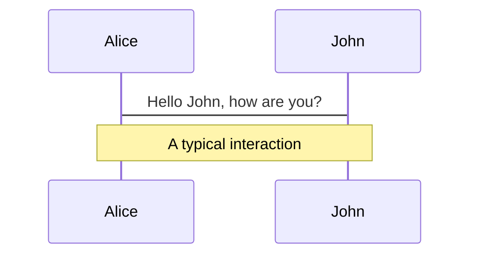
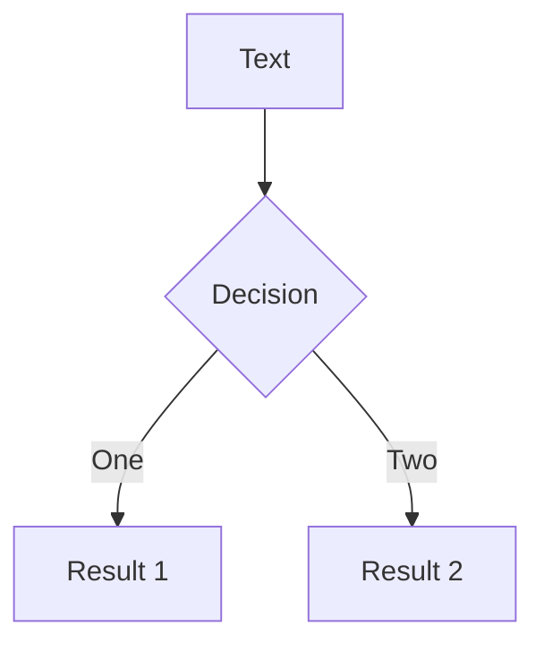
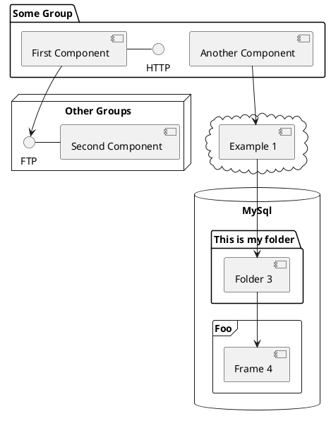

---
# try also 'default' to start simple
theme: default
# random image from a curated Unsplash collection by Anthony
# like them? see https://unsplash.com/collections/94734566/slidev
background: https://source.unsplash.com/collection/94734566/1920x1080
# apply any windi css classes to the current slide
class: 'text-center'
# https://sli.dev/custom/highlighters.html
highlighter: shiki
# show line numbers in code blocks
lineNumbers: false
# some information about the slides, markdown enabled
info: |
  ## Slidev Starter Template
  Presentation slides for developers.

  Learn more at [Sli.dev](https://sli.dev)
# persist drawings in exports and build
drawings:
  persist: false
# use UnoCSS (experimental)
css: unocss
---

# 图片优化最佳实践

图片优化对于网站的性能和加载速度至关重要。优化图片可以减少网站的加载时间，提高用户体验，减少对用户的等待时间，降低网站的跳出率。此外，优化图片还可以减少带宽消耗，节省服务器资源，降低运维成本。
<div class="pt-12">
  <div @click="$slidev.nav.next" class="px-2 py-1 rounded cursor-pointer" hover="bg-white bg-opacity-10">
    在现代 HTML 中， img 标签为我们提供了许多有用的属性来优化加载图像。让我们来看看它们 <carbon:arrow-right class="inline"/>
  </div>
</div>

<div class="abs-bl m-6 flex gap-2">
  <button @click="$slidev.nav.openInEditor()" title="Open in Editor" class="text-xl icon-btn opacity-50 !border-none !hover:text-white">
    <carbon:edit />
  </button>
  <a href="https://github.com/GreatAuk/share-img-optimize" target="_blank" alt="GitHub"
    class="text-xl icon-btn opacity-50 !border-none !hover:text-white">
    <carbon-logo-github />
  </a>
</div>
<div
  v-click
  class="abs-br m-6 flex item-center text-3xl"
  v-motion
  :initial="{ x: -80 }"
  :enter="{ x: 0 }"
>
  吴展华
  
</div>

<!--
The last comment block of each slide will be treated as slide notes. It will be visible and editable in Presenter Mode along with the slide. [Read more in the docs](https://sli.dev/guide/syntax.html#notes)
-->

---

# 一个案例
<div>
  你有一个漂亮的页面，你需要加一个背景图，你会怎么做？
</div>
<v-click>
```css
.hero {
  /* 🚩 */
  background-image: url('/image.png');
}
```
</v-click>
<div v-click>
  <div>很常规的操作，但这样写有哪些缺点？</div>
  <div>知道有哪些优化方式？</div>
</div>

---

# background-image 的缺点
<div v-show="$slidev.nav.clicks < 2">
  1. 链式请求的问题
  
  <div class="text-gray">
    在 CSS 中加载图像的情况下，假设您使用外部样式表（link rel=”styleshset” ，多数情况是这样的，而不是随处内联 style ），浏览器必须扫描您的 HTML，获取 CSS，然后找到一个 background-image 应用于一个元素，只有在所有这些之后才能获取该图像。这将需要更长的时间。
  </div>
  <div class="mt-4" v-click>2. 无法使用 img 标签的额外优势。比如说 lazy loading、格式兼容、分辨率适配等等。</div>
</div>

---

# 如何使用 img 代替 background-image ？
<div> HTML </div>
```html
<div class="container">
  
  <h1>我是背景上面的内容</h1>
</div>
```
<v-click>
<div class="mt-4"> CSS </div>

```css
  .container { position: relative; }
  .bg-image { position: absolute; inset: 0; }
  .bg-image img { width: 100%; height: 100%; object-fit: cover; }
```

<div class="text-gray text-xs">
  注意，这里只是解决了链式请求的问题，并没有使用到 img 的其他优化手段。
</div>
</v-click>


<div v-click class="my-3">
  <div class="font-bold mb-2">使用这么多额外的 HTML 是否会影响性能？</div>
  <div>
    别忘记图像有多大（以字节为单位）。通过加载更优化的版本，向 HTML 添加几个字节可以为这些图像节省数千甚至数百万字节。
  </div>
</div>

<div v-click>
  <div class="font-bold mb-2">何时考虑 background-image?</div>
  如果你有一个非常小的图像，你想用 background-repeat 平铺，没有一种简单的方法可以用 img 标签完成这种效果。
</div>

---
layout: center
---

# 在现代 HTML 中， img 标签为我们提供了许多有用的属性来优化加载图像。让我们来看看它们。

---

# 原生的 lazy-loading

延迟加载图像，直到它和视口接近到一个计算得到的距离（由浏览器定义）

```html

```
注意！！！第一次加载时立即出现在浏览器视口中的图片，不要延迟加载。这将有助于确保最关键的图像尽快加载，而所有其他图像仅在需要时加载
<div class="my-2" v-click>
  <div class="my-2 font-500">兼容问题</div>
  <div class="flex items-center">
    
    <div class="w=1/2">
      
      <a class="mt-3 ml-4" src="https://github.com/element-plus/element-plus/blob/19e3164e6af2e5a781019e94608f6a662a1950c1/packages/components/image/src/image.vue#L148-L187">Element Plus 的 image 组件兼容方式</a>
    </div>
  </div>
</div>

<div v-click>
  <div class="my-2 font-500">js 实现延迟加载</div>

  1. 通过 onscroll 事件与 `getBoundingClientRect` API 实现图片的懒加载方案
  2. 通过 Intersection Observer（交叉观察器）实现比监听 onscroll 性能更佳的图片懒加载方案
</div>

---

# 异步图像解码
浏览器在进行图片渲染展示的过程中，是需要对图片文件进行解码的，这一个过程快慢与图片格式有关。
而如果我们不希望图片的渲染解码影响页面的其他内容的展示，可以使用 decoding=async 选项

```html

```
这样，浏览器便会异步解码图像，加快显示其他内容。
<v-click>

它的可选取值如下：
- sync: 同步解码图像，保证与其他内容一起显示。
- async: 异步解码图像，加快显示其他内容。
- auto: 默认模式，表示不偏好解码模式。由浏览器决定哪种方式更适合用户

</v-click>

<div v-click class="mt-4">这是一个渐进增强方案使用, 不用考虑兼容性。</div>

---

# Resource hints

<div>
  一个更高级的选项是 fetchpriority 。向浏览器提示图像是否具有超高优先级，例如您的 LCP 图像。
</div>

```html

```

或者，降低图像的优先级，例如，如果您的图像位于首屏但重要性不高，例如在轮播的其他页面上：

```html
<div class="carousel">
  
  
  
</div>
```

---

# 图片格式的选取


---

# 图片格式总结
<div class="my-6 font-500">
  兼容性: WebP > AVIF > JPEG XL
</div>

<div>JPEG XL、AVIF、Web 各自有各自的特点与优势，并且都未完全得到任何浏览器的支持. 影响它们大规模使用的依旧是兼容问题。</div>

<div v-click class="mt-6">
  <div>相关：</div>
  <a src="https://www.bilibili.com/read/cv22543150?from=articleDetail" target="__blank">2023-03 bilibili-AVIF图片格式落地</a>
</div>
---

# 图片的异常处理

当图片链接挂了，加载失败了，我们比较好的处理方式应该是怎么样呢？

处理的方式有很多种。在张鑫旭的这篇文章中 -- **[图片加载失败后CSS样式处理最佳实践](https://www.zhangxinxu.com/wordpress/2020/10/css-style-image-load-fail/)** 有一个不错的实践。

<div v-show="$slidev.nav.clicks < 1">

核心思路为：
1. 利用图片加载失败，触发 `` 元素的 `onerror` 事件，给加载失败的 `` 元素新增一个样式类
2. 利用新增的样式类，配合 `` 元素的伪元素，在展示默认兜底图的同时，还能一起展示 `` 元素的 `alt` 信息

```css

img.error {
    position: relative;
    display: inline-block;
}
img.error::before {
    content: "";
    background: url(error-default.png);
}
img.error::after {
    content: attr(alt);
}
```

</div>

<div v-click>

  我们利用伪元素 before ，加载默认错误兜底图，利用伪元素 after，展示图片的 alt 信息：

  

</div>

---

# 更简单的方法
* [unpic-img](https://github.com/ascorbic/unpic-img)
* [Nuxt Image](https://image.nuxtjs.org/)
* [Next Image](https://nextjs.org/docs/api-reference/next/image)
* [Qwik Image](https://github.com/BuilderIO/qwik/pull/2860) (在路上了)
---

# 结论

<div>
  尽可能的使用 img 而不是 CSS background-image。
</div>
<div v-click>
  使用延迟加载、 srcset 、 picture 标签和我们上面讨论的其他优化以最佳方式传送图像。
</div>
<div v-click>
  与低优先级图像相比，请注意高优先级图像并相应地调整您的属性。
</div>

---

# What is Slidev?

Slidev is a slides maker and presenter designed for developers, consist of the following features

- 📝 **Text-based** - focus on the content with Markdown, and then style them later
- 🎨 **Themable** - theme can be shared and used with npm packages
- 🧑‍💻 **Developer Friendly** - code highlighting, live coding with autocompletion
- 🤹 **Interactive** - embedding Vue components to enhance your expressions
- 🎥 **Recording** - built-in recording and camera view
- 📤 **Portable** - export into PDF, PNGs, or even a hostable SPA
- 🛠 **Hackable** - anything possible on a webpage

<br>
<br>

Read more about [Why Slidev?](https://sli.dev/guide/why)

<!--
You can have `style` tag in markdown to override the style for the current page.
Learn more: https://sli.dev/guide/syntax#embedded-styles
-->

<style>
h1 {
  background-color: #2B90B6;
  background-image: linear-gradient(45deg, #4EC5D4 10%, #146b8c 20%);
  background-size: 100%;
  -webkit-background-clip: text;
  -moz-background-clip: text;
  -webkit-text-fill-color: transparent;
  -moz-text-fill-color: transparent;
}
</style>

---

# Navigation

Hover on the bottom-left corner to see the navigation's controls panel, [learn more](https://sli.dev/guide/navigation.html)

### Keyboard Shortcuts

|     |     |
| --- | --- |
| <kbd>right</kbd> / <kbd>space</kbd>| next animation or slide |
| <kbd>left</kbd>  / <kbd>shift</kbd><kbd>space</kbd> | previous animation or slide |
| <kbd>up</kbd> | previous slide |
| <kbd>down</kbd> | next slide |

<!-- https://sli.dev/guide/animations.html#click-animations -->

<p v-after class="absolute bottom-23 left-45 opacity-30 transform -rotate-10">Here!</p>

---
layout: image-right
image: https://source.unsplash.com/collection/94734566/1920x1080
---

# Code

Use code snippets and get the highlighting directly![^1]

```ts {all|2|1-6|9|all}
interface User {
  id: number
  firstName: string
  lastName: string
  role: string
}

function updateUser(id: number, update: User) {
  const user = getUser(id)
  const newUser = { ...user, ...update }
  saveUser(id, newUser)
}
```

<arrow v-click="3" x1="400" y1="420" x2="230" y2="330" color="#564" width="3" arrowSize="1" />

[^1]: [Learn More](https://sli.dev/guide/syntax.html#line-highlighting)

<style>
.footnotes-sep {
  @apply mt-20 opacity-10;
}
.footnotes {
  @apply text-sm opacity-75;
}
.footnote-backref {
  display: none;
}
</style>

---

# Components

<div grid="~ cols-2 gap-4">
<div>

You can use Vue components directly inside your slides.

We have provided a few built-in components like `<Tweet/>` and `<Youtube/>` that you can use directly. And adding your custom components is also super easy.

```html
<Counter :count="10" />
```

<!-- ./components/Counter.vue -->
<Counter :count="10" m="t-4" />

Check out [the guides](https://sli.dev/builtin/components.html) for more.

</div>
<div>

```html
<Tweet id="1390115482657726468" />
```

<Tweet id="1390115482657726468" scale="0.65" />

</div>
</div>


---
class: px-20
---

# Themes

Slidev comes with powerful theming support. Themes can provide styles, layouts, components, or even configurations for tools. Switching between themes by just **one edit** in your frontmatter:

<div grid="~ cols-2 gap-2" m="-t-2">

```yaml
---
theme: default
---
```

```yaml
---
theme: seriph
---
```


</div>

Read more about [How to use a theme](https://sli.dev/themes/use.html) and
check out the [Awesome Themes Gallery](https://sli.dev/themes/gallery.html).

---
preload: false
---

# Animations

Animations are powered by [@vueuse/motion](https://motion.vueuse.org/).

```html
<div
  v-motion
  :initial="{ x: -80 }"
  :enter="{ x: 0 }">
  Slidev
</div>
```

<div class="w-60 relative mt-6">
  <div class="relative w-40 h-40">
    
    
    
  </div>

  <div
    class="text-5xl absolute top-14 left-40 text-[#2B90B6] -z-1"
    v-motion
    :initial="{ x: -80, opacity: 0}"
    :enter="{ x: 0, opacity: 1, transition: { delay: 2000, duration: 1000 } }">
    Slidev
  </div>
</div>

<!-- vue script setup scripts can be directly used in markdown, and will only affects current page -->
<script setup lang="ts">
const final = {
  x: 0,
  y: 0,
  rotate: 0,
  scale: 1,
  transition: {
    type: 'spring',
    damping: 10,
    stiffness: 20,
    mass: 2
  }
}
</script>

<div
  v-motion
  :initial="{ x:35, y: 40, opacity: 0}"
  :enter="{ y: 0, opacity: 1, transition: { delay: 3500 } }">

[Learn More](https://sli.dev/guide/animations.html#motion)

</div>

---

# LaTeX

LaTeX is supported out-of-box powered by [KaTeX](https://katex.org/).

<br>

Inline $\sqrt{3x-1}+(1+x)^2$

Block
$$
\begin{array}{c}

\nabla \times \vec{\mathbf{B}} -\, \frac1c\, \frac{\partial\vec{\mathbf{E}}}{\partial t} &
= \frac{4\pi}{c}\vec{\mathbf{j}}    \nabla \cdot \vec{\mathbf{E}} & = 4 \pi \rho \\

\nabla \times \vec{\mathbf{E}}\, +\, \frac1c\, \frac{\partial\vec{\mathbf{B}}}{\partial t} & = \vec{\mathbf{0}} \\

\nabla \cdot \vec{\mathbf{B}} & = 0

\end{array}
$$

<br>

[Learn more](https://sli.dev/guide/syntax#latex)

---

# Diagrams

You can create diagrams / graphs from textual descriptions, directly in your Markdown.

<div class="grid grid-cols-3 gap-10 pt-4 -mb-6">







</div>

[Learn More](https://sli.dev/guide/syntax.html#diagrams)


---
layout: center
class: text-center
---

# Learn More

[Documentations](https://sli.dev) · [GitHub](https://github.com/slidevjs/slidev) · [Showcases](https://sli.dev/showcases.html)
